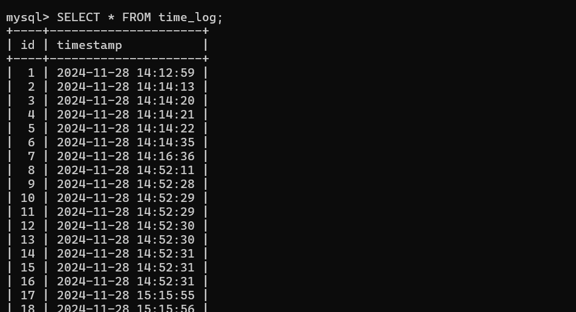
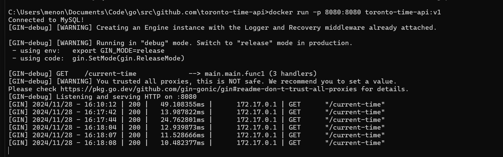

# Project: Toronto Time API

## Overview

This project provides a Go API endpoint to retrieve the current time in Toronto, Canada. It leverages a MySQL database to store the retrieved time for potential caching or logging purposes.

## Prerequisites

- Go
- Docker
- MySQL

### Create a `.env` File

Create a `.env` file in the project root with the following content:

```env
MYSQL_USER=<username>
MYSQL_PASSWORD=<password>
MYSQL_HOST=host.docker.internal
```

## Build and Run

Build the Docker image:

```bash
docker build -t toronto-time-api .
```

Run the Docker container:

```bash
docker run -p 8080:8080 toronto-time-api
```

## Screenshot

### Database 


### Docker 


### Application Running 

